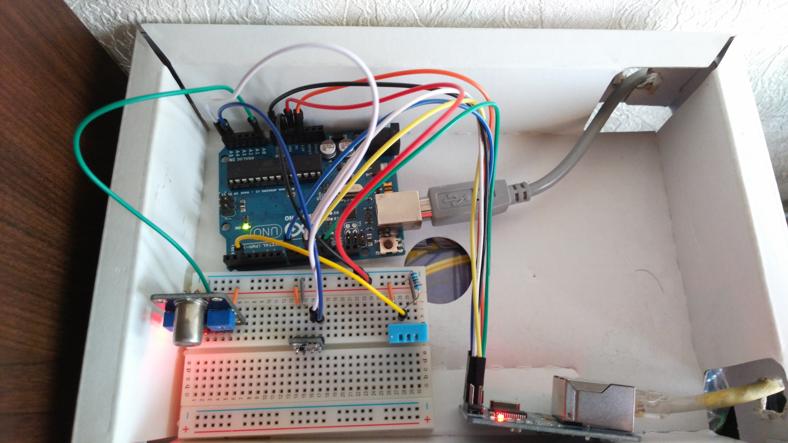
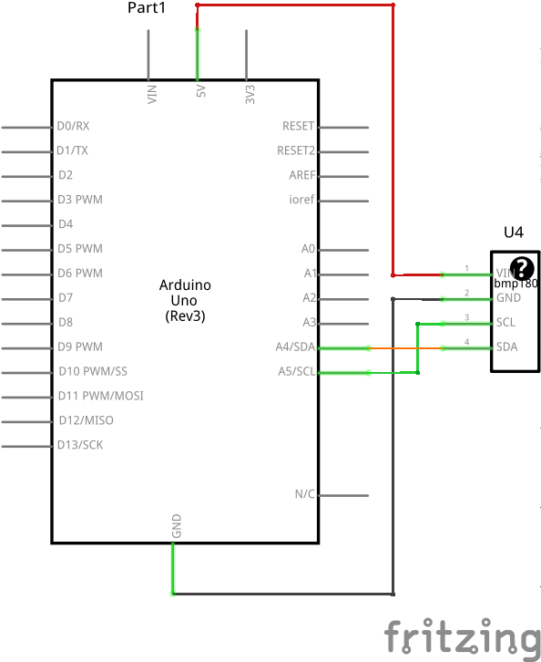
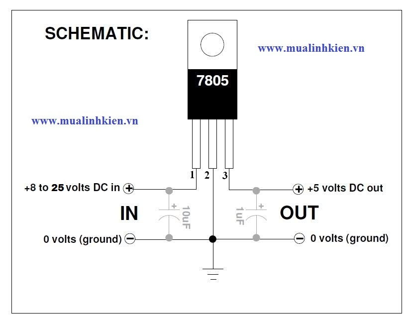

# Overview


# Features

 1. Reads co2 concentration
 2. Reads temperature
 3. Reads humidity
 4. Reads air pressure
 5. Sends data via network (UDP protocol)
 6. Handles data with [OpenHAB](http://www.openhab.org/)
 7. OpenHAB is configured for showing, persisting historical data, building charts, sending notifications (*open window*, *decrease heater* etc)

# CO2 quality
[How co2 conentration impacts humans (in ukrainian)](https://docs.google.com/document/d/1l87kJx1lqZpuicVIvCt-TA4aJeTVuhVo9qCxow-L0lQ/edit?usp=sharing)

# Used modules

## Arduino UNO

[The sketch to bind everything.](meteostation3.ino)

##  Ethernet on chip ENC28J60

All sensor values are sent via UDP periodically in form: `meteostationZval1;val2;val3;val4Z`

There is also [node.js script](udpserver.js) which listens for messages from meteostaion.

[EtherCard Library](https://github.com/jcw/ethercard)


## CO2 Sensor TGS4161


 * [Product information](tgs4161.pdf)
 * [TGS4161 DataSheet](TGS4161Dtl.pdf)

 This module can mesure [PPM](https://en.wikipedia.org/wiki/Parts-per_notation#ppm) ("parts per million" - co2 concentration value) from 350 to 10000 ppm. [Read](https://en.wikipedia.org/wiki/Carbon_dioxide#Toxicity) about CO2 toxity for humans.

 The dependency between actual ppm value and the voltage output provided by the sensor is exponential: `c=exp((a-v)/b)`, where

  * `c` - the concentration of co2 (in ppm)
  * `v` - sensor's output voltage *in millivolts* (pin `Aout`)
  * `a`, `b` - constants which have to be calibrated depending on specific sensor

  For arduino if `s` is signal then voltage `v` will be `v=(s*5000)/1024`. So having two different `v1` and `v2` and corresponding concentrations `c1` and `c2` we can find:

   * Let `z1 = Ln(c1)`, `z2 = Ln(c2)`, `d=z2-z1`
   * `a = (v1*z2-v2*z1)/d`
   * `b = (v1-v2)/d`


### Sensor calibration

 1. Refresh the room very well
 2. Let it be `375 ppm` for the completely fresh air - `c1`
 3. Read voltage value from sensor - `v1`
 4. Wait until you fill the air condition as not perfect. Let it be `600 ppm` concentrations - `c2`
 5. Read voltage value from sensor - `v2`
 6. Enter those values into [this calcuation](http://instacalc.com/40408) and you'll find `a`,`b` for the formula above.

## Temperature and humidity sensor DHT11

[DHT11 Library](https://github.com/adafruit/DHT-sensor-library)


## Presure sensor BMP180
Can measure pressure, temperature and altitude.

[MMP180 Library](https://github.com/sparkfun/BMP180_Breakout_Arduino_Library)



## Voltage stabilizator LM7805CV. [Connection scheme](http://www.ruselectronic.com/news/stabilizatory-naprjazhjenija/)



# OpenHab

 * OpenHab default location: `/opt/openhab`
 * [OpenHab](http://www.openhab.org/getting-started/) starting: `./start_debug.sh`
 * [OpenHab url](http://localhost:8080) or [demo sitemap](http://localhost:8080/openhab.app?sitemap=demo)

## Items `solvek.items`

```
Group All

/* NTP binding demo item */
DateTime    Date      "Date [%1$tA, %1$td.%1$tm.%1$tY]" <calendar>  { ntp="Europe/Berlin:de_DE" }

/* Meteostation */
Group Meteostation  (All)

Number MS_Temperature    "Temperature [%.1f °C]"  <temperature> (Meteostation)
Number MS_Humidity   "Humidity [%d %%]"  <water> (Meteostation)
Number MS_Pressure   "Pressure [%.1f mb]" <rain>  (Meteostation)

Group MS_Advanced  (Meteostation)
Number MS_CO2_Raw   "CO2 raw [%d mV]"  (MS_Advanced)
String  String_MS_raw     "Raw udp [%s]"   (MS_Advanced) {udp="<[0.0.0.0:*:'REGEX(meteostationZ(.*)Z)']"}
Number CO2_Raw_Chart_Period   "Chart Period"

Number MS_CO2 "CO2 concentration [%d ppm]" <wind> (Meteostation)
Number CO2_Chart_Period   "CO2 Chart Period"
```

## Sitemap `default.sitemap`

```
sitemap demo label="Solvek Home"
{
  Frame label="Meteostation"{
    Text item=MS_CO2 {

      Switch item=CO2_Chart_Period mappings=[0="Hour", 1="Day", 2="Week"]
      Chart item=MS_CO2 period=h refresh=6000 visibility=[CO2_Chart_Period==0, CO2_Chart_Period=="Uninitialized"]
      Chart item=MS_CO2 period=D refresh=30000 visibility=[CO2_Chart_Period==1]
      Chart item=MS_CO2 period=W refresh=30000 visibility=[CO2_Chart_Period==2]
    }

    Text item=MS_Temperature   {
      Chart item=MS_Temperature period=D refresh=30000
    }
    Text item=MS_Pressure {
      Chart item=MS_Pressure period=D refresh=30000
    }
    Text item=MS_Humidity {
      Chart item=MS_Humidity period=D refresh=30000
    }

    Text label="Advanced" icon="settings" {
        Text item=MS_CO2_Raw

        Switch item=CO2_Raw_Chart_Period label="Chart Period" mappings=[0="Hour", 1="Day", 2="Week"]
        Chart item=MS_CO2_Raw period=h refresh=6000 visibility=[CO2_Raw_Chart_Period==0, CO2_Raw_Chart_Period=="Uninitialized"]
        Chart item=MS_CO2_Raw period=D refresh=30000 visibility=[CO2_Raw_Chart_Period==1]
        Chart item=MS_CO2_Raw period=W refresh=30000 visibility=[CO2_Raw_Chart_Period==2]

        Text item=String_MS_raw
    }
  }

  Frame label="Date" {
    Text item=Date
  }
}
  ```

## Rules `solvek.rules`

```
import org.openhab.core.library.types.*
import org.openhab.core.persistence.*
import org.openhab.model.script.actions.*
import java.lang.Math
import java.lang.Double

var boolean wasTempNotifSent = false
var boolean wasCo2NotifSent = false

val double co2_c1 = 375
val double co2_c2 = 600

val double co2_v1 = 730
val double co2_v2 = 650

var double co2_z1
var double co2_z2

var double co2_d

var double co2_a
var double co2_b

rule "Init everything"
when
    System started
then
    co2_z1 = Math::log(co2_c1)
    co2_z2 = Math::log(co2_c2)

    co2_d = co2_z2 - co2_z1

    co2_a = (co2_v1*co2_z2-co2_v2*co2_z1)/co2_d
    co2_b = (co2_v1-co2_v2)/co2_d


rule "Parse raw meteostation"
when
  Item String_MS_raw received update
then
  val String ms_val = String_MS_raw.state.toString

  // Output received data to csv file
  var results = executeCommandLine(String::format("/opt/openhab/append.sh %2$s;%1$s /media/data/Temp/meteostation.csv", ms_val, now), 5000)
  logInfo("CSV_Results", results)

  val String[] parts = ms_val.split(";")

  var Number temperature = Float::parseFloat(parts.get(4))
  sendCommand(MS_Temperature, temperature)

  var Number pressure = Float::parseFloat(parts.get(5))
  sendCommand(MS_Pressure, pressure)

  var Number humidity = Integer::parseInt(parts.get(3))
  postUpdate(MS_Humidity, humidity)

  var Number co2_raw = Integer::parseInt(parts.get(1))
  postUpdate(MS_CO2_Raw, co2_raw)

rule "Control heating consuming"
when
  Item MS_Temperature received update
then
  if ((MS_Temperature.state > 24) && (!wasTempNotifSent)) {
    wasTempNotifSent = true
    pushover("Do not waste heating energy!")
    createTimer(now.plusHours(1)) [|
        wasTempNotifSent = false
      ]
  }

rule "Calculate co2 concentration"
when
    Item MS_CO2_Raw received update
then
    var double r = co2_a-MS_CO2_Raw.state
    r = (r/co2_b).doubleValue
//    logInfo("Solvek", "Calculating result, exponent="+r+", type="+r.class.getSimpleName)
    r = Math::exp(r).intValue
//    logInfo("Solvek", "Calculated result: "+r)

    postUpdate(MS_CO2, r)

rule "Send message about hight ppm"
when
    Item MS_CO2 received update
then
  if ((MS_CO2.state > 600) && (!wasCo2NotifSent)) {
    wasCo2NotifSent = true
    pushover("Refresh the room", 2)
    createTimer(now.plusHours(1)) [|
        wasCo2NotifSent = false
      ]
  }
  ```

## `rrd4j.persist`

  ```
  // persistence strategies have a name and a definition and are referred to in the "Items" section
Strategies {
  // for rrd charts, we need a cron strategy
  everyMinute : "0 * * * * ?"
}

Items {
  MS_CO2_Raw,MS_Temperature,DemoSwitch,NoOfLights,Window_GF_Toilet,Heating* : strategy = everyChange, everyMinute, restoreOnStartup

  // let's only store temperature values in rrd
  Temperature*,Weather_Chart* : strategy = everyMinute, restoreOnStartup
}
```
